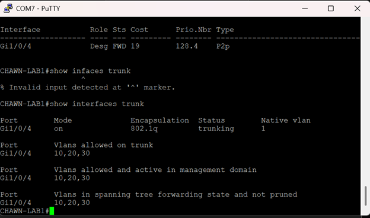
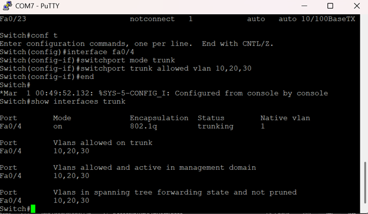

# Cisco-VLAN-HomeLab
VLAN trunking lab using 2 Cisco switches (VLAN 10/20/30, STP, access + trunk ports)
## Topology

- **Switch 1:**  
- **Switch 2:**   

- **Trunk link**
  - `Gi1/0/4` (Chawn-Lab1) ↔ `Fa0/4` (Switch)
  - Encapsulation: 802.1Q
  - Allowed VLANs: 10, 20, 30
  - Native VLAN: 1

- **VLANs**

  | VLAN | Name  |
  |------|-------|
  | 10   | RED   |
  | 20   | BLUE  |
  | 30   | GREEN |

- **Access ports (for end devices)**  
  Switch 1(Chawn-Lab1):
  - `Gi1/0/1` → VLAN 10 (RED)  
  - `Gi1/0/2` → VLAN 20 (BLUE)  
  - `Gi1/0/3` → VLAN 30 (GREEN)

  Switch 2(Switch):
  - `Fa0/1` → VLAN 10 (RED)  
  - `Fa0/2` → VLAN 20 (BLUE)  
  - `Fa0/3` → VLAN 30 (GREEN)

At the moment I only have one laptop, so I test by moving it between access ports on each switch. The switches are fully configured for multiple hosts once I add more devices.

---

## Key Configuration

### VLANs

```bash
vlan 10
 name RED
vlan 20
 name BLUE
vlan 30
 name GREEN
```
### Trunk ports

**Switch 1**

```bash
! Configure trunk on Switch 1 (2960-X)
interface Gi1/0/4
 switchport mode trunk
 switchport trunk allowed vlan 10,20,30
```

**Switch 2**

```bash
! Configure trunk on Switch 2 (2960)
interface Fa0/4
 switchport mode trunk
 switchport trunk allowed vlan 10,20,30
```

These commands configure the trunk link between Switch 1 and Switch 2 to carry VLANs 10, 20, and 30 using 802.1Q.

### Verification

Trunk status on Switch 1:



Trunk status on Switch 2:



## Lab 2 – Management VLAN + SSH

### Goal

Create a dedicated management VLAN (VLAN 99) and enable SSH access to both switches.

### IP plan

- Laptop (USB Ethernet): `192.168.99.100/24`
- 2960-X (CORE) `Vlan99`: `192.168.99.11/24`
- 2960 (ACCESS) `Vlan99`: `192.168.99.12/24`
- Management VLAN: **VLAN 99 (MGMT)**

### Key configuration steps

**On both switches**

- Created VLAN 99 and named it `MGMT`.
- Configured `interface vlan 99` with a static IP.
- Enabled SSH:
  - Set `hostname` and `ip domain-name`.
  - Created local user `netadmin` with privilege 15.
  - Generated RSA keys (`crypto key generate rsa 2048`).
  - Configured `line vty 0 4` for SSH only and `login local`.

**Trunk links**

- 2960-X: `Gi1/0/4` is a trunk.
- 2960: `Fa0/4` is a trunk.
- Trunk allowed VLANs: `10,20,30,99`

**Management access ports**

- 2960-X: `Gi1/0/24` is an access port in VLAN 99.
- 2960: `Fa0/24` is an access port in VLAN 99.

### Verification

- `show ip interface brief` on both switches to see `Vlan99` up/up with the correct IP.
- `show interfaces trunk` to confirm VLAN 99 is allowed on the trunk.
- From the laptop:
  - `ping 192.168.99.11`
  - `ping 192.168.99.12`
- SSH tests using PuTTY:
  - `192.168.99.11` → CORE-2960X
  - `192.168.99.12` → ACCESS-2960

Screenshots for this lab are in:

- `screenshots/lab2-management-vlan-ssh/`

